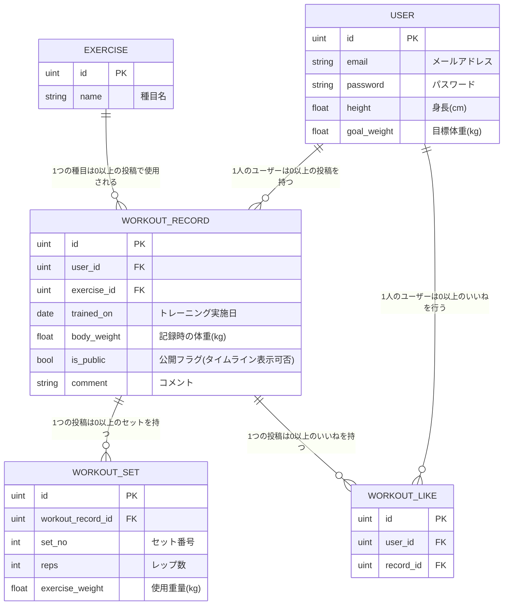

```mermaid
erDiagram
    USER ||--o{ WORKOUT_RECORD : "1人のユーザーは0以上の投稿を持つ"
    WORKOUT_RECORD ||--o{ WORKOUT_SET : "1つの投稿は0以上のセットを持つ"
    EXERCISE ||--o{ WORKOUT_RECORD : "1つの種目は0以上の投稿で使用される"
    USER ||--o{ WORKOUT_LIKE : "1人のユーザーは0以上のいいねを行う"
    WORKOUT_RECORD ||--o{ WORKOUT_LIKE : "1つの投稿は0以上のいいねを持つ"

    USER {
        uint id PK
        string email "メールアドレス"
        string password "パスワード"
        float height "身長(cm)"
        float goal_weight "目標体重(kg)"
    }
    EXERCISE {
        uint id PK
        string name "種目名"
    }
    WORKOUT_RECORD {
        uint id PK
        uint user_id FK
        uint exercise_id FK
        date trained_on "トレーニング実施日"
        float body_weight "記録時の体重(kg)"
        bool is_public "公開フラグ(タイムライン表示可否)"
        string comment "コメント"
    }
    WORKOUT_SET {
        uint id PK
        uint workout_record_id FK
        int set_no "セット番号"
        int reps "レップ数"
        float exercise_weight "使用重量(kg)"
    }
    WORKOUT_LIKE {
        uint id PK
        uint user_id FK
        uint record_id FK
    }
```
