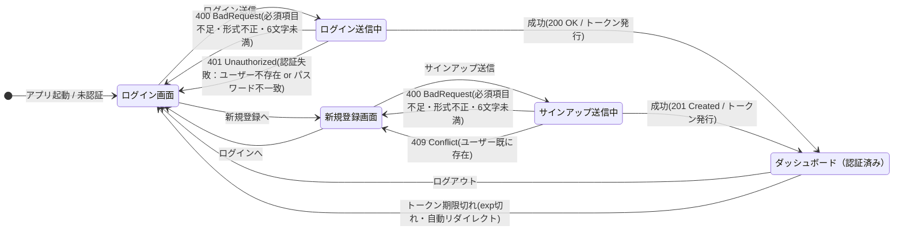

```mermaid
stateDiagram-v2
    direction LR

    [*] --> LoginPage : アプリ起動 / 未認証

    state "ログイン画面" as LoginPage
    state "新規登録画面" as SignupPage
    state "ダッシュボード（認証済み）" as Dashboard

    %% 画面遷移
    LoginPage --> SignupPage : 新規登録へ
    SignupPage --> LoginPage : ログインへ

    %% ログイン処理
    LoginPage --> LoginSubmitting : ログイン送信
    state "ログイン送信中" as LoginSubmitting

    LoginSubmitting --> Dashboard : 成功(200 OK / トークン発行)
    LoginSubmitting --> LoginPage : 400 BadRequest(必須項目不足・形式不正・6文字未満)
    LoginSubmitting --> LoginPage : 401 Unauthorized(認証失敗：ユーザー不存在 or パスワード不一致)

    %% サインアップ処理
    SignupPage --> SignupSubmitting : サインアップ送信
    state "サインアップ送信中" as SignupSubmitting

    SignupSubmitting --> Dashboard : 成功(201 Created / トークン発行)
    SignupSubmitting --> SignupPage : 400 BadRequest(必須項目不足・形式不正・6文字未満)
    SignupSubmitting --> SignupPage : 409 Conflict(ユーザー既に存在)

    %% 認証状態の変化
    Dashboard --> LoginPage : ログアウト
    Dashboard --> LoginPage : トークン期限切れ(exp切れ・自動リダイレクト)
```
