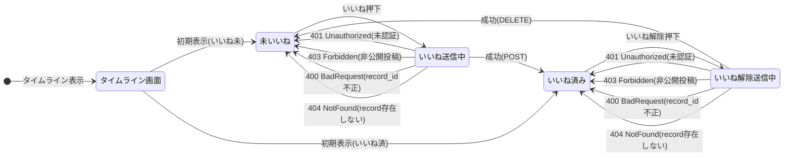

```mermaid
stateDiagram-v2
    direction LR

    [*] --> Timeline : タイムライン表示

    state "タイムライン画面" as Timeline
    state "未いいね" as NotLiked
    state "いいね済み" as Liked
    state "いいね送信中" as LikeSubmitting
    state "いいね解除送信中" as UnlikeSubmitting

    %% 初期状態
    Timeline --> NotLiked : 初期表示(いいね未)
    Timeline --> Liked : 初期表示(いいね済)

    %% いいね操作
    NotLiked --> LikeSubmitting : いいね押下
    LikeSubmitting --> Liked : 成功(POST)
    LikeSubmitting --> NotLiked : 401 Unauthorized(未認証)
    LikeSubmitting --> NotLiked : 403 Forbidden(非公開投稿)
    LikeSubmitting --> NotLiked : 400 BadRequest(record_id不正)
    LikeSubmitting --> NotLiked : 404 NotFound(record存在しない)

    %% いいね解除操作
    Liked --> UnlikeSubmitting : いいね解除押下
    UnlikeSubmitting --> NotLiked : 成功(DELETE)
    UnlikeSubmitting --> Liked : 401 Unauthorized(未認証)
    UnlikeSubmitting --> Liked : 403 Forbidden(非公開投稿)
    UnlikeSubmitting --> Liked : 400 BadRequest(record_id不正)
    UnlikeSubmitting --> Liked : 404 NotFound(record存在しない)
```
